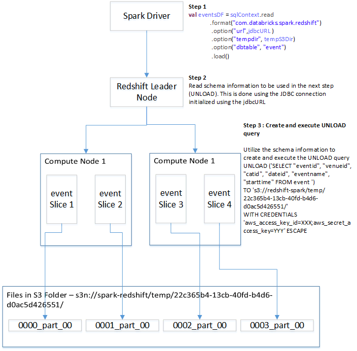
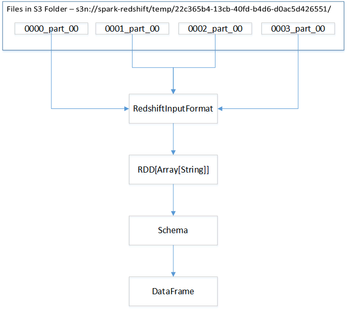
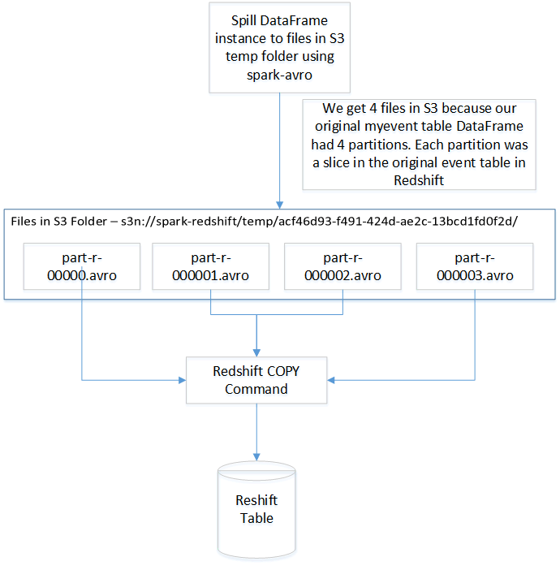

The [Spark Data Sources API](https://databricks.com/blog/2015/01/09/spark-sql-data-sources-api-unified-data-access-for-the-spark-platform.html)introduced in Spark 1.2 supports a pluggable mechanism for integration with structured data-sources. It is a unified API designed to support two major operations:

1. Loading structured data from an external data source into Spark
2. Storing structured data from Spark into an external data source.

The Data Sources API has built in integration for several data sources such as Hive, Avro, Json, JDBC and Parquet. Third party integration is added through spark-packages. One such integration is for Amazon Redshift which is provided by the spark-redshift package. 

Prior to the introduction of spark-redshift, Spark’s JDBC data source was the only way for Spark users to read data from Redshift. While this method is adequate when running queries returning a small number of rows (order of 100’s), it is too slow when handling large scale data. The reason being that JDBC provides a ResultSet based approach where rows are retrieved in a single thread in small batches. Furthermore, the use of JDBC to store large datasets in Redshift is only practical when data needs to be moved between tables inside a Redshift database. The JDBC based INSERT/UPDATE queries are only practical for small updates to Redshift tables. For users hoping to load or store large volumes of data from Redshift, JDBC leaves much to be desired in terms of performance and throughput.

This tutorial will provide a hand-on experience in using the spark-redshift package from your local development environment.

##Prepare the Redshift database##

Before we delve into specific examples of how spark-redshift works let us configure the Redshift database which we will be using.

For the purpose of this article I will use the sample [TICKT](http://docs.aws.amazon.com/redshift/latest/dg/c_sampledb.html) database on Redshift. This database enables the tracking of  sales activity for the fictional TICKIT web site, where users buy and sell tickets online for various types of events. The database allows analysis of sales over time, performance of sellers, venues and correlation of sales with seasons. This information can be used to drive advertising and promotions campaigns.  

When you start the Redshift service you will first need to create the TICKT database and load it. Follow the instructions [here](http://docs.aws.amazon.com/redshift/latest/dg/cm-dev-t-load-sample-data.html) to create/load the TICKT database.

For the purpose of this article my Redshift database runs on a 2 node cluster. Each node manages 2 slices for a total of 4 slices. This *usually* (read Redshift [documentation](http://docs.aws.amazon.com/redshift/latest/dg/c_high_level_system_architecture.html) for a more nuanced discussion) means that each table will be stored in 4 separate partitions, one for each slice. 

## Usage##

We are ready to interact with Redshift using the spark-redshift library. The skeleton of the program we will be using is shown in Listing 1. You can also use the Spark REPL to run the lines listed in the program below.

```scala
package com.databricks.spark.redshift.tutorial
import org.apache.spark.{SparkConf,SparkContext}
import org.apache.spark.sql.SaveMode
import java.io.File
import org.apache.spark.sql.types.{StructType,StructField,StringType,IntegerType,LongType,DecimalType}


object SparkRedshiftTutorial {
  /*
   * For Windows Users only
   * 1. Download contents from link https://github.com/srccodes/hadoop-common-2.2.0-bin/archive/master.zip
   * 2. Unzip the file in step 1 into your %HADOOP_HOME%/bin. In the example below  %HADOOP_HOME%=C:/MySoftware/hdphome
   * 3. After step 2 %HADOOP_HOME/bin should contain winutils.exe
   * 
  */
  if(System.getProperty("os.name").startsWith("Windows")){
    val hdphome:File = new File("C:/MySoftware/hdphome");
    System.setProperty("hadoop.home.dir",hdphome.getAbsolutePath().toString())    
  }
  
  def main(args:Array[String]):Unit = {
    val awsAccessKeyId = args(0) 
    val awsSecretAccessKey = args(1)    
    val redshiftDBName = args(2)
    val redshiftUserId= args(3)
    val redshiftPassword= args(4)
    /**
      * Sample URL-swredshift.czac2vcs84ci.us-east-1.redshift.amazonaws.com:5439
      */
    val redshifturl = args(5) 
    val jdbcURL = s"jdbc:redshift://$redshifturl/$redshiftDBName?user=$redshiftUserId&password=$redshiftPassword"

    val sc = new SparkContext(new SparkConf().setAppName("SparkSQL").setMaster("local"))

	/*Configure SparkContext to communicate with AWS*/
	val tempS3Dir = "s3n://redshift-spark/temp/"
    sc.hadoopConfiguration.set("fs.s3n.awsAccessKeyId", awsAccessKeyId)
    sc.hadoopConfiguration.set("fs.s3n.awsSecretAccessKey", awsSecretAccessKey)

	/*Create the SQL Context*/    
    val sqlContext = new org.apache.spark.sql.SQLContext(sc)
  }
} 
```
Listing 1 : SparkRedshiftExamples.scala skeleton

We need the following set of user provided parameters to communicate with AWS in general and Redshift in particular -

- **AWS Access Key and AWS Secret Access Key** - This key pair will be used to communicate with AWS services. This information is passed by the AWS Client libraries in every interaction with AWS.
- **Redshift Database Name** - When you provision the Redshift service you have to provide a name of for your database. This is similar to a schema in Oracle. The name of my Redshift database was sparkredshift
- **Redshift UserId/Password combination** - You will need to provide this information when the Redshift service was provisioned.
- **Redshift URL** - You will need to obtain this from your Redshift Console. A sample Redshift URL is `swredshift.czac2vcs84ci.us-east-1.redshift.amazonaws.com:5439`

Your Redshift console will provide the JDBC URL to use. It follows the pattern

`jdbc:redshift://$redshifturl/$redshiftDBName?user=$redshiftUserId&password=$redshiftPassword`

A sample JDBC URL is

`jdbc:redshift://swredshift.czac2vcs84ci.us-east-1.redshift.amazonaws.com:5439/sparkredshift?user=spark&password=mysecretpass`

spark-redshift reads and writes data to S3 when transferring data to/from Redshift, so you'll need to specify a path in S3 where the library should write these temporary files. spark-redshift cannot automatically clean up the temporary files it creates in S3. As a result, we recommend that you use a dedicated temporary S3 bucket with an [object lifecycle configuration ](http://docs.aws.amazon.com/AmazonS3/latest/dev/object-lifecycle-mgmt.html) to ensure that temporary files are automatically deleted after a specified expiration period. For this example we create a S3 bucket `redshift-spark`. We tell spark-redshift that we will use the following temporary location in S3 to store temporary files generated by spark-redshift `s3n://redshift-spark/temp/`

Next enable the communication with AWS by configuring the following properties in the `SparkContext` instance-

- fs.s3n.awsAccessKeyId 
- fs.s3n.awsSecretAccessKey

Lastly we create the SQLContext to use the Data Source API to communicate with Redshift

`val sqlContext = new org.apache.spark.sql.SQLContext(sc)`

### Load Function - Reading from a Redshift table###

Let us fetch data from the Redshift table `event`. Add the following lines of code listed in Listing 2 to the program in Listing 1

```scala
import sqlContext.implicits._
val eventsDF = sqlContext.read
               .format("com.databricks.spark.redshift")
               .option("url",jdbcURL ) 
               .option("tempdir", tempS3Dir) 
               .option("dbtable", "event")
               .load()
eventsDF.show()   
```
Listing 2 : Reading an entire Redshift table 

`.format("com.databricks.spark.redshift")` line tells the DataSource API that we are using the `spark-redshift` package. It uses this information to identify the class `DefaultSource` in the package specified by the `format` invocation. This class contains the entry points for the functionality provided by the Data Sources API implementation.

Next we provide the parameters necessary to read the `event` table. We provide the JDBC URL, the temporary S3 folder which will be used to copy the table data to and the table name we want to read. A comprehensive list of parameters is listed on the spark-redshift documentation [page](https://github.com/databricks/spark-redshift#parameters).

The lines in Listing 2 will execute to produce the following output

```{r, engine='bash'}
+-------+-------+-----+------+------------------+--------------------+
|eventid|venueid|catid|dateid|         eventname|           starttime|
+-------+-------+-----+------+------------------+--------------------+
|   1433|    248|    6|  1827|            Grease|2008-01-01 19:00:...|
|   2811|    207|    7|  1827|  Spring Awakening|2008-01-01 15:00:...|
|   4135|     16|    9|  1827|               Nas|2008-01-01 14:30:...|
|   5807|     45|    9|  1827| Return To Forever|2008-01-01 15:00:...|
|   1738|    260|    6|  1828|      Beatles LOVE|2008-01-02 20:00:...|
|   2131|    212|    7|  1828|           Macbeth|2008-01-02 15:00:...|
|   2494|    203|    7|  1828|     The Caretaker|2008-01-02 19:00:...|
|   2824|    248|    7|  1828|  Cirque du Soleil|2008-01-02 19:00:...|
|   2920|    209|    7|  1828|           Macbeth|2008-01-02 19:30:...|
|   4853|     39|    9|  1828|        Rick Braun|2008-01-02 19:00:...|
|    394|    300|    8|  1829|Adriana Lecouvreur|2008-01-03 15:00:...|
|   2043|    217|    7|  1829|       The Bacchae|2008-01-03 19:00:...|
|   5508|     55|    9|  1829|        Ryan Adams|2008-01-03 19:30:...|
|   6071|     47|    9|  1829|      3 Doors Down|2008-01-03 15:00:...|
|   6120|    130|    9|  1829|         Bob Dylan|2008-01-03 19:30:...|
|   7468|     37|    9|  1829|        Commodores|2008-01-03 19:00:...|
|   1567|    257|    6|  1830|    Blue Man Group|2008-01-04 15:00:...|
|   1764|    262|    6|  1830|        Mamma Mia!|2008-01-04 20:00:...|
|   1981|    219|    7|  1830|         King Lear|2008-01-04 15:00:...|
|   2274|    222|    7|  1830|     The Caretaker|2008-01-04 20:00:...|
+-------+-------+-----+------+------------------+--------------------+
only showing top 20 rows
```

spark-redshift automatically reads the schema from the Redshift table and maps its types back to Spark SQL's types. The command `eventsDF.printSchema()` produces the following output

```{r, engine='bash'}
root
 |-- eventid: integer (nullable = true)
 |-- venueid: integer (nullable = true)
 |-- catid: integer (nullable = true)
 |-- dateid: integer (nullable = true)
 |-- eventname: string (nullable = true)
 |-- starttime: timestamp (nullable = true)
```

We can even register the DataFrame instance as a temporary table in Spark and execute queries against it as follows

```scala
eventsDF.registerTempTable("myevent")
val myEventDF = sqlContext.sql("select * myevent")
```

While the above examples used Scala we could have also used SQL. An example of writing to a Redshift table in SQL is show below

```{r, engine='bash'}
> %sql

CREATE TEMPORARY TABLE myevent 
USING com.databricks.spark.redshift
OPTIONS (
  dbtable 'event', 
  tempdir 's3n://redshift-spark/temp/',
  url 'jdbc:redshift://swredshift.czac2vcs84ci.us-east-1.redshift.amazonaws.com:5439/sparkredshift?user=spark&password=mysecretpass'
);     
select * from myevent; 
```

Note that we have registered a temporary table `myevent` in Spark and executed a query against it (`select * from myevent`) just like we did in our Scala example.

### Load Function - Reading from a Redshift query###

We can also read from a Redshift query. Listing 3 shows how to read the most recent 10000 records from the `sales` table. Notice that the line `.option("dbtable", "event")` is replaced with the line `.option("query", salesQuery) `

```scala
val salesQuery = """select salesid,listid,sellerid,buyerid,
                           eventid,dateid,qtysold,pricepaid,commission 
                           from sales 
                           order by saletime desc LIMIT 10000"""
val salesDF = sqlContext.read
             .format("com.databricks.spark.redshift")
             .option("url",jdbcURL ) 
             .option("tempdir", tempS3Dir) 
             .option("query", salesQuery)
             .load()
salesDF.show()
```
Listing 3: Reading from a Redshift query

The lines in Listing 3 will execute to produce the following output

```{r, engine='bash'}
+-------+------+--------+-------+-------+------+-------+---------+----------+
|salesid|listid|sellerid|buyerid|eventid|dateid|qtysold|pricepaid|commission|
+-------+------+--------+-------+-------+------+-------+---------+----------+
| 102373|117133|   26190|  35491|   2141|  2191|      4|  1008.00|    151.20|
|  75861| 86640|   43402|  39545|   8372|  2191|      2|   372.00|     55.80|
|  56302| 63546|    5760|   5797|   1489|  2191|      2|   372.00|     55.80|
|  83603| 95341|   27027|  27881|   6034|  2191|      1|   288.00|     43.20|
|  40652| 45468|   27557|  28366|   5099|  2191|      2|   510.00|     76.50|
| 157586|206655|   13213|  47394|   3665|  2191|      2|  4018.00|    602.70|
|  99761|114026|    7466|  21189|   5621|  2191|      2|   102.00|     15.30|
|  68467| 77797|   49538|  27029|   1489|  2191|      2|   188.00|     28.20|
|  66470| 75420|   22851|  37849|   7604|  2191|      2|   420.00|     63.00|
|  36700| 40838|   15099|  45514|   8027|  2191|      4|  1400.00|    210.00|
| 126896|145346|   18243|  10273|   6783|  2191|      2|   866.00|    129.90|
|  55416| 62529|   42223|  26273|   1489|  2191|      4|   532.00|     79.80|
|  48503| 54812|   42828|  12282|   8372|  2191|      2|    80.00|     12.00|
|   3737|  4035|   11666|  23692|   6034|  2191|      2|   302.00|     45.30|
| 154069|178359|    3897|   5815|   8168|  2191|      1|   290.00|     43.50|
|  37817| 42124|   24592|  26543|   6783|  2191|      4|  1300.00|    195.00|
|    924|   933|   48898|  25710|   1594|  2191|      3|   504.00|     75.60|
| 112232|128585|   30390|  44375|    914|  2191|      1|   126.00|     18.90|
|  97099|110826|   24730|  32758|   3331|  2190|      1|   319.00|     47.85|
|  74902| 85497|   45049|   2318|   7547|  2190|      2|   554.00|     83.10|
+-------+------+--------+-------+-------+------+-------+---------+----------+
only showing top 20 rows
```

### Under the hoods - Load Function ###

In this section we will take a peek inside spark-redshift to understand how exactly the LOAD function works. Specifically we will look at how `event` table was read into a DataFrame. The LOAD is a two step process

1. [UNLOAD](http://docs.aws.amazon.com/redshift/latest/dg/r_UNLOAD.html) data from the Redshift table to S3
2. Consume the unloaded files in S3 via a custom InputFormat into an RDD which is then wrapped as a DataFrame instance using the schema obtained from Redshift.

#### UNLOAD Redshift to S3 ####

Figure 1 shows the the actions required to perform this step.



Figure 1 : UNLOAD action

First the Spark Driver communicates with the Redshift Leader node to obtain the schema of the table (or query) requested. The attribute `override lazy val schema: StructType` in the class `com.databricks.spark.redshift.RedshiftRelation` will obtain the schema on demand by invoking the method `resolveTable` of the class `com.databricks.spark.redshift.JDBCWrapper`. The `JDBCWrapper` class is responsible for fetching the schema from the Redshift Leader.   

Next a Redshift [UNLOAD](http://docs.aws.amazon.com/redshift/latest/dg/r_UNLOAD.html) query is created using the schema information obtained. The UNLOAD command unloads each slice into a s3 folder (22c365b4-13cb-40fd-b4d6-d0ac5d426551) created in the temporary s3 location (s3n://spark-redshift/temp/) provided by the user. Each file contains a row per line and each column of the row is pipe (|) delimited. This process occurs in parallel for each slice. The spark-redshift library achieves its high performance through this mechanism.

#### Read UNLOAD'ed S3 files into a DataFrame instance####

Figure 2 shows how the files unloaded in S3 are consumed to form a DataFrame instance


Figure 2 : Read from S3 into a DataFrame  

Once the files are written to S3, a custom InputFormat implemented in the class `com.databricks.spark.redshift.RedshiftInputFormat` is used to consume the files in parallel. This class is similar to the standard and well known `TextInputFormat` where the key is the byte offset of the start of each line in the file. The value class however, is of type `Array[String]` (unlike `TextInputFormat`where it is `Text`). The value instance is created by splitting the lines using the default delimiter |. The `RedshiftInputFormat` consumes the S3 files line by line to produce an `RDD`. The schema obtained earlier is applied on this `RDD` to generate an instance of a `DataFrame`.

### Save Function - Writing to a Redshift table###

spark-redshift allows you to write data back to Redshift. The source data is a `DataFrame` instance. We will need to assume that we have a source table available in the environment. This table can be sourced could be from a variety of sources such as a Hive table, CSV file, parquet file, delimited text file, etc. We will source a DataFrame from Redshift and write it back. This is for illustration purposes only. In practice the source would not be Redshift since in such a case it is easiest to perform a "CREATE TABLE AS" query on Redshift without going through Spark-SQL. 

Listing 4 will register the `event` table as `myevent` table in the Spark environment.

```scala
val eventQuery = "select * from event"
val eventDF = sqlContext.read
             .format("com.databricks.spark.redshift")
             .option("url",jdbcURL ) 
             .option("tempdir", tempS3Dir)
             .option("query", eventQuery) 
             .load()   
eventsDF.registerTempTable("myevent") 
```
Listing 4: Create a table myevent in the Spark environment

Listing 5 demonstrates how to write the contents of `myevent` to a Redshift table `redshiftevent`

```scala
/*
 *Create a new table redshiftevent after dropping any existing redshiftevent table
 *and write event records with event id less than 1000
 */
sqlContext.sql("select * from myevent where eventid<=1000").withColumnRenamed("eventid", "id")
             .write.format("com.databricks.spark.redshift")
            .option("url", jdbcURL)
            .option("tempdir", tempS3Dir)
            .option("dbtable", "redshiftevent")
            .mode(SaveMode.Overwrite) 
            .save()
/*
 *Append to an existing table redshiftevent if it exists or create a new one if it does not
 *exist and write event records with event id greater than 1000
 */

sqlContext.sql("select * from myevent where eventid>1000").withColumnRenamed("eventid", "id")
          .write.format("com.databricks.spark.redshift")
          .option("url", jdbcURL) 
          .option("tempdir", tempS3Dir) 
          .option("dbtable", "redshiftevent") 
          .mode(SaveMode.Append)
          .save()
```
Listing 5: Writing to Redshift tables

spark-redshift automatically creates a Redshift table with the appropriate schema determined from the table/DataFrame being written. The default behavior is to create a new table and to throw an error message if a table with the same name already exists (corresponding to `SaveMode.ErrorIfExists`)

There are two key points to note in Listing 5-

1. Note the `.withColumnRenamed("eventid", "id")`. This feature if necessary if any of the source table columns names are key words in Redshift (ex. table) then spark-redshift will throw and error. This will be [fixed](https://github.com/databricks/spark-redshift/issues/80) in the next release 
2. Note how we utilize the modes. The first write utilizes the mode `SaveMode.Overwrite` which means that the table will be dropped and recreated it exists. The second query utilizes `SaveMode.Append` which will create the table if it does not exist but will append to it if it does. The default mode is `SaveMode.ErrorIfExists` which creates the table if it does not exists and throws and error if it does. The last mode is `SaveMode.Ignore` which is same as `SaveMode.Overwrite` if the table does not exist but does nothing if the table exists.

While the above examples used Scala we could have also used SQL. And example of writing to a Redshift table in SQL is shows in Listing 6. The only thing to be aware of in the SQL mode is that SaveMode's are not available and only the default mode (`SaveMode.ErrorIfExists`) is in force.

```sql
> %sql
CREATE TABLE redshiftevent
USING com.databricks.spark.redshift
OPTIONS (
dbtable 'redshiftevent',
tempdir 's3n://redshift-spark/temp/',
  url 'jdbc:redshift://swredshift.czac2vcs84ci.us-east-1.redshift.amazonaws.com:5439/sparkredshift?user=spark&password=mysecretpass'
)
AS SELECT * FROM myevent;
```

By default the save operation uses the key distribution [style](http://docs.aws.amazon.com/redshift/latest/dg/c_choosing_dist_sort.html) of `EVEN` in Redshift. This can be changed by the use of option parameter `diststyle` and `distkey`. See spark-redshift [documentation](https://github.com/databricks/spark-redshift) for details.

### Under the hoods - Save Function ###

The implementation of the Save function is provided in the class `com.databricks.spark.redshift.RedshiftWriter`.   



The sequence of steps involved in performing the save function are-

1. The data from the `DataFrame` instance is written out in parallel to the temporary S3 folder. spark-avro is used to write the data to ensure that it encapsulates the schema.
2. Next a Redshift [COPY](http://docs.aws.amazon.com/redshift/latest/dg/r_COPY.html) command is created and invoked to load the files created in the temporary S3 folder are loaded it into a Redshift table which respects the value of the `SaveMode` parameter passed.


## Integration multiple Datasources ##

Data read via spark-redshift is automatically converted to `DataFrame` objects, Spark’s primary abstraction for large datasets. This promotes interoperability between data sources, since types are automatically converted to Spark’s standard representations(for example `StringType`, `DecimalType`). A Redshift user can, for instance, join Redshift tables with data stored in S3, Hive tables, CSV or Parquet files stored on HDFS. This flexibility is important to users with complex data pipelines involving multiple sources.

To illustrate this concepts consider Listing 6

```scala
 
val salesAGGQuery = """select sales.eventid as id,
                       sum(qtysold) as totalqty,sum(pricepaid) as salesamt
                       from sales
                       group by (sales.eventid)
                   """
val salesAGGDF = sqlContext.read
               .format("com.databricks.spark.redshift")
               .option("url",jdbcURL)
               .option("tempdir", tempS3Dir)
               .option("query", salesAGGQuery)
               .load()   

   
val salesAGGDF2=salesAGGDF.join(eventsDF, salesAGGDF("id") === eventsDF("eventid"))
                         .select("id", "eventname","totalqty","salesamt")
```
Listing 6: Working with DataFrame instances

While both `eventDF` and `salesAGGDF` table are sourced from Redshift, assume for the sake of illustration that they are sourced from a non-Redshift datasource. This should not be too far-fetched since the DataFrame class is part of the Data Sources API and not the spark-redshift library. A DataFrame can be created from any data source compatible with the Data Sources API

`salesAGGDF2` DataFrame is created by joining `eventsDF` and `salesAGGDF2` where we register `salesAGGDFWithSchema` with a custom schema and register it as a temporary table `redshift_sales_agg` before saving it to Redshift with name  `redshift_sales_agg`
  
Next consider Listing 7

```scala
/*Provide a custom schema*/
val schema = StructType(List(StructField("eventid",IntegerType,false),
                                StructField("eventname",StringType,false),
                                StructField("qtysold",LongType,false),
                                StructField("revenue",DecimalType(38,2),false)
                                ))
val salesAGGDFWithSchema = sqlContext.createDataFrame(salesAGGDF2.rdd, schema)
salesAGGDFWithSchema.registerTempTable("redshift_sales_agg")

sqlContext.sql("select * from redshift_sales_agg")
             .write.format("com.databricks.spark.redshift")
             .option("url", jdbcURL) 
             .option("tempdir", tempS3Dir) 
             .option("dbtable", "redshift_sales_agg") 
             .mode(SaveMode.Overwrite)
             .save()
```
Listing 7: Providing Custom Schema

Note how we have specified every column as non-nullable in the custom schema.

In this section we illustrated how Data Sources API provides a unified API to work with multiple datasources. This feature is enabled by the generic `DataFrame` interface. We also looked at how a `DataFrame` can be saved to Redshift with a user-defined schema. None of this is unique to spark-redshift. It is provided by the DataSources API for use with all compatible packages. This is the feature that makes the DataSource API such a powerful tool for ETL usecases.

## Under the Hood - Putting it all together##

As we discussed earlier Spark SQL will introspect for a class called `DefaultSource` in the Datasources API package `com.databricks.spark.redshift`. The `DefaultSource` class implements the trait `RelationProvider` class which is provides the default load functionality for the library. It consumes the parameters provided by the user and converts it to an instance of `BaseRelation` which is implemented by the class `com.databricks.spark.redshift.RedshiftRelation`. 

This `com.databricks.spark.redshift.RedshiftRelation` class is responsible for providing an `RDD` of `org.apache.spark.sql.Row` which backs the `org.apache.spark.sql.DataFrame` instance. This represents the underlying implementation for the Load functionality for the spark-redshift package where the schema is inferred from the underlying Redshift table. The functionality for performing load where the user provides the schema is supported by the trait `org.apache.spark.sql.sources.SchemaRelationProvider` and is implemented in the class `RedshiftRelation` . 

The store functionality of the spark-redshift package is supported by the trait `org.apache.spark.sql.sources.CreatableRelationProvider` implemented by the `RedshiftWriter`.


## Conclusion ###

Data Sources API provides a unified interface for handling structured data in Spark. It was introduced in Spark 1.2 through the spark-sql package. It unifies structured data sources under a common interface which is richer than the original RDD based approach which utilized InputFormat API of Hadoop. In this article we explored how the spark-redshift package expands the Data Sources API to support Amazon Redshift which is becoming increasingly popular choice in the Enterprise IT infrastructure.
