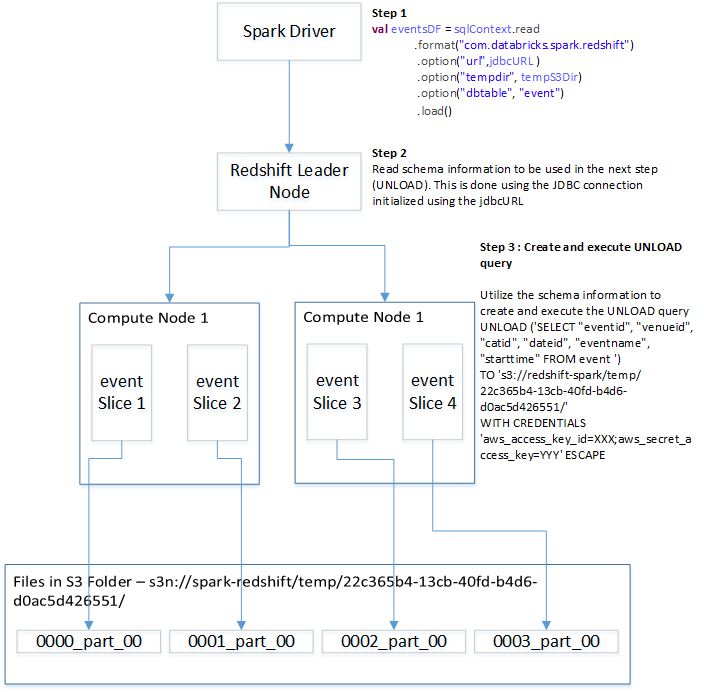
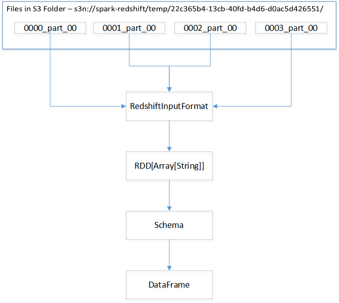

# Tutorial #

The [Spark Data Sources API](https://databricks.com/blog/2015/01/09/spark-sql-data-sources-api-unified-data-access-for-the-spark-platform.html) introduced in Spark 1.2 supports a pluggable mechanism for integration with structured data-sources. It is a unified API designed to support two major operations:

1. Loading structured data from an external data source into Spark
2. Storing structured data from Spark into an external data source.

Spark ships with built-in integration for several data sources such as Hive, Avro, JSON, JDBC and Parquet, all implemented using the Data Sources API. Many [third-party data sources](http://spark-packages.org/?q=tags%3A%22Data%20Sources%22) are available. The `spark-redshift` library is a data source for [Amazon Redshift](https://aws.amazon.com/redshift/).

Prior to `spark-redshift`, JDBC was the only way for Spark users to easily read data from Redshift. While this method is adequate when running queries that return small numbers of rows (order of thousands), it is too slow when handling large-scale data. This is because JDBC provides a ResultSet-based approach where rows are retrieved in by single thread in small batches. Furthermore, the use of JDBC to store large datasets in Redshift is only practical when data needs to be moved between tables inside a Redshift database. The JDBC based INSERT/UPDATE queries are only practical for small updates to Redshift tables. For users hoping to load or store huge volumes of data from/to Redshift, JDBC leaves much to be desired in terms of performance and throughput.

This tutorial provides a hand-on guide to using the `spark-redshift` package from your local development environment. It also provides a deep dive into the implementation details of `spark-redshift` which will enable you to gain a deeper understanding of why `spark-redshift` provides a high performance alternative to a plain JDBC-based approach for interacting with Redshift from Spark.

## Prepare the Redshift database ##

Before we delve into specific examples of how `spark-redshift` works, let's configure the Redshift database which we will be using.

In this tutorial, we will use the sample [TICKT](http://docs.aws.amazon.com/redshift/latest/dg/c_sampledb.html) database on Redshift. This database tracks sales activity for the fictional TICKIT web site, where users buy and sell tickets online for various types of events. The database allows analysis of sales over time, performance of sellers, venues and correlation of sales with seasons. This information can be used to drive advertising and promotions campaigns.

When you start the Redshift service you will first need to create the TICKT database and load it. Follow the instructions [here](http://docs.aws.amazon.com/redshift/latest/dg/cm-dev-t-load-sample-data.html) to create/load the TICKT database.

In the examples below, we used a Redshift database running on a 2-node cluster. Each node manages 2 slices, giving our cluster a total of 4 slices. This *usually* means that each table in our database will be stored in 4 separate partitions, one for each slice (for a more nuanced discussion of partitioning, see the [Redshift  documentation](http://docs.aws.amazon.com/redshift/latest/dg/c_high_level_system_architecture.html)).

## Usage ##

We are ready to interact with Redshift using the `spark-redshift` library. The skeleton of the program we will be using is shown below. The entire `SparkRedshiftTutorial.scala` program can be accessed from [here](SparkRedshiftTutorial.scala). You can also use the Spark REPL to run the lines listed in the program below.

```scala
object SparkRedshiftTutorial {
  def main(args:Array[String]): Unit = {

    val awsAccessKeyId = args(0)
    val awsSecretAccessKey = args(1)
    val redshiftDBName = args(2)
    val redshiftUserId = args(3)
    val redshiftPassword = args(4)
    val redshifturl = args(5)
    val jdbcURL = s"jdbc:redshift://$redshifturl/$redshiftDBName?user=$redshiftUserId&password=$redshiftPassword"

    val sc = new SparkContext(new SparkConf().setAppName("SparkSQL").setMaster("local"))

	// Configure SparkContext to communicate with AWS
	val tempS3Dir = "s3n://redshift-spark/temp/"
    sc.hadoopConfiguration.set("fs.s3n.awsAccessKeyId", awsAccessKeyId)
    sc.hadoopConfiguration.set("fs.s3n.awsSecretAccessKey", awsSecretAccessKey)

	// Create the SQL Context
    val sqlContext = new SQLContext(sc)
  }
}
```

We need the following set of user provided parameters to communicate with Redshift and other AWS services:

- **AWS Access Key and AWS Secret Access Key**: This key pair will be used to communicate with AWS services. This information is passed by the AWS client libraries in every interaction with AWS.
- **Redshift Database Name**: When you provision the Redshift service you have to provide a name for your database. This is similar to a schema in Oracle. In this tutorial, the name of our Redshift database was `sparkredshift`.
- **Redshift UserId/Password combination**: You will need to provide this information when the Redshift service is provisioned.
- **Redshift URL**: You will need to obtain this from your Redshift Console. A sample Redshift URL is `swredshift.czac2vcs84ci.us-east-1.redshift.amazonaws.com:5439`

The Redshift console will provide the JDBC URL to use; it follows the pattern

```
jdbc:redshift://$redshifturl/$redshiftDBName?user=$redshiftUserId&password=$redshiftPassword
```

A sample JDBC URL is

```
jdbc:redshift://swredshift.czac2vcs84ci.us-east-1.redshift.amazonaws.com:5439/sparkredshift?user=spark&password=mysecretpass
```

`spark-redshift` reads and writes data to S3 when transferring data from/to Redshift, so you'll need to specify a path in S3 where the library should write these temporary files. `spark-redshift` cannot automatically clean up the temporary files it creates in S3. As a result, we recommend that you use a dedicated temporary S3 bucket with an [object lifecycle configuration ](http://docs.aws.amazon.com/AmazonS3/latest/dev/object-lifecycle-mgmt.html) to ensure that temporary files are automatically deleted after a specified expiration period. For this example we create a S3 bucket `redshift-spark`. We tell `spark-redshift` that we will use the following temporary location in S3 to store temporary files generated by `spark-redshift`:

```scala
val tempS3Dir = "s3n://redshift-spark/temp/"
```

Next, configure AWS security credentials by setting following properties in the `SparkContext`'s `hadoopConfiguration`:

```scala
sc.hadoopConfiguration.set("fs.s3n.awsAccessKeyId", awsAccessKeyId)
sc.hadoopConfiguration.set("fs.s3n.awsSecretAccessKey", awsSecretAccessKey)
```

Finally, we create the `SQLContext` so that we can use the Data Sources API to communicate with Redshift:

```scala
val sqlContext = new SQLContext(sc)
```

### Load Function - Reading from a Redshift table ###

Let's fetch data from the Redshift `event` table. Add the following lines of code to the skeleton listed above:

```scala
import sqlContext.implicits._
val eventsDF = sqlContext.read
	.format("io.github.spark_redshift_community.spark.redshift")
	.option("url",jdbcURL )
	.option("tempdir", tempS3Dir)
	.option("dbtable", "event")
	.load()
eventsDF.show()
```


The `.format("io.github.spark_redshift_community.spark.redshift")` line tells the Data Sources API that we are using the `spark-redshift` package. It uses this information to load the proper `DefaultSource` class from the specified package. This class contains the entry points for the data source implementation.

Next we provide the parameters necessary to read the `event` table from Redshift. We provide the JDBC URL, the temporary S3 folder where the table data will be copied to, and the name of the table we want to read. A comprehensive list of parameters is listed on the `spark-redshift` [README](https://github.com/spark-redshift-community/spark-redshift).

Executing the above lines will produce the following output:

```{r, engine='bash'}
+-------+-------+-----+------+------------------+--------------------+
|eventid|venueid|catid|dateid|         eventname|           starttime|
+-------+-------+-----+------+------------------+--------------------+
|   1433|    248|    6|  1827|            Grease|2008-01-01 19:00:...|
|   2811|    207|    7|  1827|  Spring Awakening|2008-01-01 15:00:...|
|   4135|     16|    9|  1827|               Nas|2008-01-01 14:30:...|
|   5807|     45|    9|  1827| Return To Forever|2008-01-01 15:00:...|
|   1738|    260|    6|  1828|      Beatles LOVE|2008-01-02 20:00:...|
|   2131|    212|    7|  1828|           Macbeth|2008-01-02 15:00:...|
|   2494|    203|    7|  1828|     The Caretaker|2008-01-02 19:00:...|
|   2824|    248|    7|  1828|  Cirque du Soleil|2008-01-02 19:00:...|
|   2920|    209|    7|  1828|           Macbeth|2008-01-02 19:30:...|
|   4853|     39|    9|  1828|        Rick Braun|2008-01-02 19:00:...|
|    394|    300|    8|  1829|Adriana Lecouvreur|2008-01-03 15:00:...|
|   2043|    217|    7|  1829|       The Bacchae|2008-01-03 19:00:...|
|   5508|     55|    9|  1829|        Ryan Adams|2008-01-03 19:30:...|
|   6071|     47|    9|  1829|      3 Doors Down|2008-01-03 15:00:...|
|   6120|    130|    9|  1829|         Bob Dylan|2008-01-03 19:30:...|
|   7468|     37|    9|  1829|        Commodores|2008-01-03 19:00:...|
|   1567|    257|    6|  1830|    Blue Man Group|2008-01-04 15:00:...|
|   1764|    262|    6|  1830|        Mamma Mia!|2008-01-04 20:00:...|
|   1981|    219|    7|  1830|         King Lear|2008-01-04 15:00:...|
|   2274|    222|    7|  1830|     The Caretaker|2008-01-04 20:00:...|
+-------+-------+-----+------+------------------+--------------------+
only showing top 20 rows
```

`spark-redshift` automatically reads the schema from the Redshift table and maps its types back to Spark SQL's types. The command `eventsDF.printSchema()` produces the following output:

```{r, engine='bash'}
root
 |-- eventid: integer (nullable = true)
 |-- venueid: integer (nullable = true)
 |-- catid: integer (nullable = true)
 |-- dateid: integer (nullable = true)
 |-- eventname: string (nullable = true)
 |-- starttime: timestamp (nullable = true)
```

We can register the `DataFrame` as a temporary table in Spark and execute queries against it using the SQL APIs:

```scala
eventsDF.registerTempTable("myevent")
val myEventDF = sqlContext.sql("SELECT * FROM myevent")
```

While the above examples used Scala, we could have also used SQL as follows:

```sql
CREATE TEMPORARY TABLE myevent
USING io.github.spark_redshift_community.spark.redshift
OPTIONS (
  dbtable 'event',
  tempdir 's3n://redshift-spark/temp/',
  url 'jdbc:redshift://swredshift.czac2vcs84ci.us-east-1.redshift.amazonaws.com:5439/sparkredshift?user=spark&password=mysecretpass'
);
SELECT * FROM myevent;
```

Note, we have registered a temporary table `myevent` in Spark and executed a query against it (`SELECT * FROM myevent`) just like we did in our Scala example.

### Load Function - Reading from a Redshift query ###

We can also create DataFrames from the results of Redshift queries. The following code block demonstrates how to create a DataFrame from a Redshift query which selects the most recent 10000 records from the `sales` table:

```scala
val salesQuery = """
    SELECT salesid, listid, sellerid, buyerid,
           eventid, dateid, qtysold, pricepaid,
           commission 
    FROM sales 
    ORDER BY saletime DESC LIMIT 10000"""
val salesDF = sqlContext.read
    .format("io.github.spark_redshift_community.spark.redshift")
    .option("url", jdbcURL) 
    .option("tempdir", tempS3Dir) 
    .option("query", salesQuery)
    .load()
salesDF.show()
```

Notice that the line `.option("dbtable", "event")` is replaced with the line `.option("query", salesQuery)`. This will result in the following output:

```{r, engine='bash'}
+-------+------+--------+-------+-------+------+-------+---------+----------+
|salesid|listid|sellerid|buyerid|eventid|dateid|qtysold|pricepaid|commission|
+-------+------+--------+-------+-------+------+-------+---------+----------+
| 102373|117133|   26190|  35491|   2141|  2191|      4|  1008.00|    151.20|
|  75861| 86640|   43402|  39545|   8372|  2191|      2|   372.00|     55.80|
|  56302| 63546|    5760|   5797|   1489|  2191|      2|   372.00|     55.80|
|  83603| 95341|   27027|  27881|   6034|  2191|      1|   288.00|     43.20|
|  40652| 45468|   27557|  28366|   5099|  2191|      2|   510.00|     76.50|
| 157586|206655|   13213|  47394|   3665|  2191|      2|  4018.00|    602.70|
|  99761|114026|    7466|  21189|   5621|  2191|      2|   102.00|     15.30|
|  68467| 77797|   49538|  27029|   1489|  2191|      2|   188.00|     28.20|
|  66470| 75420|   22851|  37849|   7604|  2191|      2|   420.00|     63.00|
|  36700| 40838|   15099|  45514|   8027|  2191|      4|  1400.00|    210.00|
| 126896|145346|   18243|  10273|   6783|  2191|      2|   866.00|    129.90|
|  55416| 62529|   42223|  26273|   1489|  2191|      4|   532.00|     79.80|
|  48503| 54812|   42828|  12282|   8372|  2191|      2|    80.00|     12.00|
|   3737|  4035|   11666|  23692|   6034|  2191|      2|   302.00|     45.30|
| 154069|178359|    3897|   5815|   8168|  2191|      1|   290.00|     43.50|
|  37817| 42124|   24592|  26543|   6783|  2191|      4|  1300.00|    195.00|
|    924|   933|   48898|  25710|   1594|  2191|      3|   504.00|     75.60|
| 112232|128585|   30390|  44375|    914|  2191|      1|   126.00|     18.90|
|  97099|110826|   24730|  32758|   3331|  2190|      1|   319.00|     47.85|
|  74902| 85497|   45049|   2318|   7547|  2190|      2|   554.00|     83.10|
+-------+------+--------+-------+-------+------+-------+---------+----------+
only showing top 20 rows
```

### Under the hood - Load Function ###

In this section we will take a peek inside `spark-redshift` to understand how the LOAD function is implemented. Specifically, we will look at how the `event` table was read into a `DataFrame`. The LOAD is a two-step process:

1. [UNLOAD](http://docs.aws.amazon.com/redshift/latest/dg/r_UNLOAD.html) data from the Redshift table to S3.
2. Using a custom InputFormat, read the unloaded files from S3 into an RDD, then use the schema obtained from Redshift to convert the RDD into a `DataFrame`.
#### UNLOAD Redshift to S3 ####

The following diagram shows the steps that are performed when Spark Redshift UNLOADs data from Redshift to S3:



First, the Spark Driver communicates with the Redshift leader node to obtain the schema of the table (or query) requested. This is done by issuing a `DESCRIBE TABLE` query over a JDBC connection, then parsing its output and mapping its types back to Spark SQL types.

Next, a Redshift [UNLOAD](http://docs.aws.amazon.com/redshift/latest/dg/r_UNLOAD.html) query is created using the schema information obtained. The UNLOAD command unloads each slice into a S3 folder (`22c365b4-13cb-40fd-b4d6-d0ac5d426551`) created in the temporary S3 location provided by the user (`s3n://spark-redshift/temp/`). Each file contains one row per line and each column of the row is pipe (`|`) delimited. This process occurs in parallel for each slice. The `spark-redshift` library achieves its high performance through this mechanism.

#### Read UNLOAD'ed S3 files into a DataFrame instance ####

The diagram below shows how the files unloaded in S3 are consumed to form a `DataFrame`:



Once the files are written to S3, a custom InputFormat (`io.github.spark_redshift_community.spark.redshift.RedshiftInputFormat`) is used to consume the files in parallel. This class is similar to Hadoop's standard `TextInputFormat` class, where the key is the byte offset of the start of each line in the file. The value class, however, is of type `Array[String]` (unlike, `TextInputFormat`, whose type is `Text`). The values are created by splitting the lines using the default delimiter (`|`). The `RedshiftInputFormat` processes the S3 files line-by-line to produce an `RDD`. The schema obtained earlier is then applied on this `RDD` to convert the strings to the proper data types and to generate a `DataFrame`.

### Save Function - Writing to a Redshift table ###

`spark-redshift` also allows you to write data back to Redshift. The data being saved can originate from a variety of sources, such a Hive tables, CSV, Parquet, or delimited text files. In order to illustrate this feature, the example below will create a `DataFrame` from a Redshift table, register it as a temporary table in Spark, then write it back to Redshift. Of course, we could have also saved a DataFrame created from a different source.

In the previous section, we registered the `Dataframe` `eventDF`, which represents the `event` Redshift table in Spark as a temporary table named `myevent`:

```scala
eventsDF.registerTempTable("myevent")
```

Let
s write the contents of this `myevent` temporary table to a Redshift table named `redshiftevent`:

```scala
// Create a new table, `redshiftevent`, after dropping any existing redshiftevent table,
// then write event records with event id less than 1000
sqlContext.sql("SELECT * FROM myevent WHERE eventid <= 1000").withColumnRenamed("eventid", "id")
    .write.format("io.github.spark_redshift_community.spark.redshift")
    .option("url", jdbcURL)
    .option("tempdir", tempS3Dir)
    .option("dbtable", "redshiftevent")
    .mode(SaveMode.Overwrite)
    .save()

// Append to an existing table redshiftevent if it exists or create a new one if it does 
// not exist, then write event records with event id greater than 1000
sqlContext.sql("SELECT * FROM myevent WHERE eventid > 1000").withColumnRenamed("eventid", "id")
    .write.format("io.github.spark_redshift_community.spark.redshift")
    .option("url", jdbcURL)
    .option("tempdir", tempS3Dir)
    .option("dbtable", "redshiftevent")
    .mode(SaveMode.Append)
    .save()
```

`spark-redshift` automatically creates a Redshift table with the appropriate schema determined from the table or DataFrame being written. The default behavior is to create a new table and throw an error message if a table with the same name already exists (this corresponds to `SaveMode.ErrorIfExists`)

There are two key points to note:

1. Note the `.withColumnRenamed("eventid", "id")`; this allows us to rename columns prior to saving the data.
2. Note how we use the modes. The first write uses the mode `SaveMode.Overwrite`, which means that the table will be dropped and recreated it exists. The second query uses `SaveMode.Append`, which will create the table if it does not exist but will append to the table if it already exists. The default mode is `SaveMode.ErrorIfExists`, which creates the table if it does not exist and throws an error if it does. The last mode is `SaveMode.Ignore`, which is same as `SaveMode.Overwrite` if the table does not exist but does nothing if the table exists.

We could have achieved similar results using SQL. The only thing to be aware of when using the SQL API is that all the of the SaveModes are not available, so only the default mode (`SaveMode.ErrorIfExists`) is applicable.

```sql
CREATE TABLE redshiftevent
USING io.github.spark_redshift_community.spark.redshift
OPTIONS (
  dbtable 'redshiftevent',
  tempdir 's3n://redshift-spark/temp/',
  url 'jdbc:redshift://swredshift.czac2vcs84ci.us-east-1.redshift.amazonaws.com:5439/sparkredshift?user=spark&password=mysecretpass'
)
AS SELECT * FROM myevent;
```

By default, the save operation uses the `EVEN` [key distribution style](http://docs.aws.amazon.com/redshift/latest/dg/c_choosing_dist_sort.html) in Redshift. This can be changed by using the optional parameters `diststyle` and `distkey`. See the full [spark-redshift documentation](https://github.com/spark-redshift-community/spark-redshift) for details.

### Under the hood - Save Function ###

`spark-redshift`'s save functionality is implemented in the class, `io.github.spark_redshift_community.spark.redshift.RedshiftWriter`. The following diagram shows how the `save` function works:


The save function performs the following steps:

1. The partitions of the `DataFrame` are written out in parallel to the temporary S3 folder specified by the user. `spark-avro` is used to write the schema-compliant data.
2. A Redshift [COPY](http://docs.aws.amazon.com/redshift/latest/dg/r_COPY.html) command is created and invoked to load the Avro files from S3 folder into the Redshift table.


## Integration with other Data Sources ##

Data read via `spark-redshift` is automatically converted to `DataFrame`s, Spark’s primary abstraction for large structured datasets. This promotes interoperability between data sources, since types are automatically converted to Spark’s standard representations (for example `StringType`, `DecimalType`). A Redshift user can, for instance, join Redshift tables with data stored in S3, Hive tables, CSV or Parquet files stored on HDFS. This flexibility is important to users with complex data pipelines involving multiple sources.

The following code snippet illustrates these concepts:

```scala

val salesAGGQuery = """
    SELECT
        sales.eventid AS id,
        sum(qtysold) AS totalqty,
        sum(pricepaid) AS salesamt
    FROM sales
    GROUP BY sales.eventid"""
val salesAGGDF = sqlContext.read
    .format("io.github.spark_redshift_community.spark.redshift")
    .option("url",jdbcURL)
    .option("tempdir", tempS3Dir)
    .option("query", salesAGGQuery)
    .load()


val salesAGGDF2 = salesAGGDF.join(eventsDF, salesAGGDF("id") === eventsDF("eventid"))
    .select("id", "eventname","totalqty","salesamt")
```

While both the `eventDF` and `salesAGGDF` tables are sourced from Redshift, assume for the sake of illustration that they are sourced from a non-Redshift data sources. A `DataFrame` can be created from any data source compatible with the Data Sources API.

The `salesAGGDF2` `DataFrame` is created by joining `eventsDF` and `salesAGGDF2`. We register it as a temporary table `redshift_sales_agg` before saving it to Redshift with the same name, `redshift_sales_agg`.


```scala
salesAGGDF2.registerTempTable("redshift_sales_agg")

sqlContext.sql("SELECT * FROM redshift_sales_agg")
	.write.format("io.github.spark_redshift_community.spark.redshift")
	.option("url", jdbcURL)
	.option("tempdir", tempS3Dir)
	.option("dbtable", "redshift_sales_agg")
	.mode(SaveMode.Overwrite)
	.save()
```


## Under the hood - Putting it all together ##

As we discussed earlier Spark SQL will search for a class named `DefaultSource` in the data source's package, `io.github.spark_redshift_community.spark.redshift`. The `DefaultSource` class implements the `RelationProvider` trait, which provides the default load functionality for the library. The `RelationProvider` trait provides methods which consume the user-provided configuration parameters and return instances of `BaseRelation`, which `spark-redshift` implements using class `io.github.spark_redshift_community.spark.redshift.RedshiftRelation`.

The `io.github.spark_redshift_community.spark.redshift.RedshiftRelation` class is responsible for providing an `RDD` of `org.apache.spark.sql.Row` which backs the `org.apache.spark.sql.DataFrame` instance. This represents the underlying implementation for the load functionality for the `spark-redshift` package where the schema is inferred from the underlying Redshift table. The load function which supports the a user-defined schema is supported by the trait `org.apache.spark.sql.sources.SchemaRelationProvider` and implemented in the class `RedshiftRelation`.

The store functionality of the `spark-redshift` package is supported by the trait `org.apache.spark.sql.sources.CreatableRelationProvider` and implemented by the class `io.github.spark_redshift_community.spark.redshift.RedshiftWriter`.


## Conclusion ###

The Data Sources API provides a unified interface for handling structured data. It unifies structured data sources under a common interface which is richer than the original RDD/InputFormat-based approach. In this tutorial we explored how the `spark-redshift` package uses the Data Sources API to provide support for Amazon Redshift, which is becoming an increasingly popular choice in enterprise IT infrastructure.
